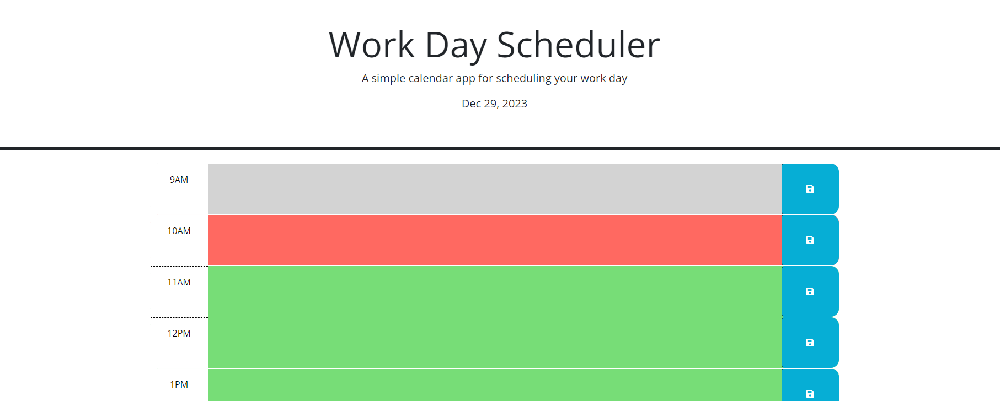

# Scheduler Application
This is a simple calendar application that allows users to save events for each hour of a typical working day (9am-5pm). The application runs in the browser and features dynamically updated HTML and CSS powered by jQuery. It utilizes the Day.js library to work with date and time.

## Functionality

The calendar application provides the following functionality:

The current day is displayed at the top of the calendar.

Timeblocks are displayed for each hour of the standard business hours (9am-5pm).

Each timeblock is color-coded to indicate whether it is in the past, present, or future.

Users can click on a timeblock to enter an event or task for that hour.

Users can save the entered event by clicking the save button for the corresponding timeblock.

The saved events are stored in the local storage of the browser.

When the page is refreshed, the saved events persist and are displayed in the respective timeblocks.

## Getting Started

To run the calendar application locally, follow these steps:

Clone the repository to your local machine.

Open the index.html file in a web browser.

## Dependencies

The calendar application relies on the following dependencies:

jQuery: A fast, small, and feature-rich JavaScript library.

Day.js: A minimalist JavaScript library for parsing, validating, manipulating, and formatting dates.

These dependencies are included in the starter code and do not require any additional installation.

## Contributing

Contributions to the calendar application are welcome! If you find any issues or have suggestions for improvements, please submit an issue or pull request.

## License

This project is licensed under the MIT License.

## Acknowledgements

The starter code for this calendar application was provided as part of an assignment in the full stack application development course.

